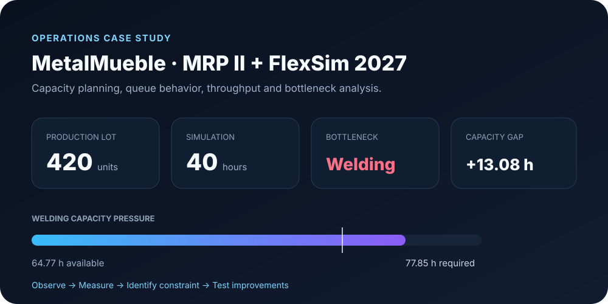

  

  <strong>Administration × Operations × Process Optimization × Technology</strong>

  I am interested in managing businesses and operations with a continuous-improvement mindset: 
  <strong>measure what is happening, remove friction, recover wasted time and use technology where it creates real value.</strong>

  
  
  

---

## Management mindset

> **I build better ways of working.**

I do not see administration as simply supervising what already exists. I am interested in understanding **how work flows**, where time is being lost, which activities add value, where errors are repeated and what can be improved through better processes, data, automation or software.

<table>
<tr>
<td width="25%"><strong>01 · Observe</strong> Understand the real workflow before changing it.</td>
<td width="25%"><strong>02 · Measure</strong> Use KPIs, capacity, demand and operational data.</td>
<td width="25%"><strong>03 · Optimize</strong> Reduce bottlenecks, unnecessary steps and idle time.</td>
<td width="25%"><strong>04 · Automate</strong> Use software and AI when they save time or improve control.</td>
</tr>
</table>

**The goal is not technology for its own sake.** The goal is better execution: fewer manual tasks, faster information flow, stronger control and better decisions.

---

## Featured work

### ReservaFlow · From scattered bookings to an operating system

| **Operational problem** | **What I built** | **Management value** |
| --- | --- | --- |
| Reservations spread across messages, notes or spreadsheets create duplication, weak visibility and avoidable errors. | A full-stack reservation system with authentication, CRUD workflows, dashboard metrics, search, filters, conflict prevention and validation. | A repetitive administrative workflow becomes a structured digital process with better control, faster information access and fewer manual steps. |

**Stack:** Python · Flask · SQLite · JavaScript · Bootstrap · GitHub Actions

[**View repository →**](https://github.com/jtincovalverde/ReservaFlow) · [**Watch video demo →**](https://www.youtube.com/watch?v=mBzinlOeNAw)

### MetalMueble · Find the constraint before adding resources

  

A manufacturing-capacity and discrete-event simulation case study combining **MRP II, FlexSim 2027, FlexScript, Python, queues, capacity analysis and KPI validation**.

The model helps answer a management question that appears in many operations: **where is the real constraint, and what does the data say before we spend more resources?** In the base case, Welding is identified as the overloaded work center, with **77.85 h required vs 64.77 h available**.

[**View repository →**](https://github.com/jtincovalverde/MetalMueble-MRP-II-FlexSim)

### Operations Management Control Center · Turn capacity data into a decision

**Management question:** Does the operation really need more capacity everywhere, or is the pressure concentrated in one work center?

| Required workload | Available capacity | Overall utilization | Bottleneck | Local gap |
| ---: | ---: | ---: | --- | ---: |
| **220.1 h** | **254.0 h** | **86.7%** | **Welding** | **-11.8 h** |

The analysis shows a useful management lesson: **aggregate capacity is sufficient, but one local constraint can still limit the operation.** Instead of recommending more resources everywhere, the project identifies the bottleneck, classifies risk and tests a targeted scenario.

A focused **+12 h capacity scenario in Welding** removes the immediate overload and reduces local utilization from **119.7% to 99.7%**. The result also shows why management should protect a resilience buffer rather than operate permanently at the limit.

**Tools:** Python · Pandas · Matplotlib · KPI design · Capacity planning · Scenario analysis · Decision support

[**View project →**](https://github.com/jtincovalverde/jtincovalverde/tree/main/projects/operations-kpi-dashboard) · [**Read executive summary →**](https://github.com/jtincovalverde/jtincovalverde/blob/main/projects/operations-kpi-dashboard/executive_summary.md)

---

## Analytics lab

### 📈 Demand Forecasting Demo

Six-month demand forecasting lab using **trend and seasonal features, linear regression, holdout validation and MAE**.

`Python` `scikit-learn` `Pandas` `Forecasting` `Data`

[**View project →**](https://github.com/jtincovalverde/jtincovalverde/tree/main/projects/demand-forecasting-demo)

---

## What I am building toward

My professional direction sits at the intersection of **administration, operations and technology**.

I want to help organizations operate better by combining:

- **Administration & business control** — coordination, reporting, resource control and execution.
- **Operations & industrial engineering** — process improvement, capacity planning, bottlenecks, MRP II and simulation.
- **Data & decision support** — KPIs, analysis, forecasting and management visibility.
- **Automation & software** — Python, Flask, SQL, JavaScript and practical AI applications.

### The kind of questions I like solving

- Why are people spending hours on a task that could be simplified or automated?
- Where is the actual bottleneck in the process?
- Which KPI would help management see the problem earlier?
- Can idle time be converted into productive capacity?
- Are we adding people because we need them, or because the process is poorly designed?
- What information does a manager need to make the decision faster and with less uncertainty?

---

## Toolkit

  
  
  
  
  
  
  
  
  
  

---

## Verified learning

### 🎓 CS50x · Introduction to Computer Science

Completed in **2026** through Harvard / CS50. ReservaFlow was developed as the final project.

[**Verify certificate →**](https://cs50.harvard.edu/certificates/33971312-603f-44b5-ae8c-69c073080305)

---

## Current focus

**Business systems · Process optimization · Operations analytics · Applied AI · Automation · Decision support**

  <strong>Observe → Measure → Improve → Automate → Measure again</strong>

  <a href="https://github.com/jtincovalverde/ReservaFlow">ReservaFlow</a> ·
  <a href="https://github.com/jtincovalverde/MetalMueble-MRP-II-FlexSim">MetalMueble</a> ·
  <a href="https://cs50.harvard.edu/certificates/33971312-603f-44b5-ae8c-69c073080305">CS50x Certificate</a>

Portfolio lab datasets are synthetic. AI-assisted development is disclosed where applicable. The MetalMueble repository explicitly identifies its academic group-work context; ReservaFlow contains its own CS50x AI-assistance disclosure.
