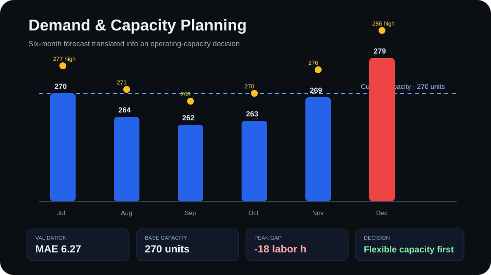

# Demand & Capacity Planning System

A management-oriented forecasting project that converts expected demand into **capacity requirements, staffing pressure, risk signals and a recommended operating response**.

> Portfolio lab created with AI-assisted development. The dataset and operating assumptions are synthetic and are used only to demonstrate a transparent planning workflow.

## Management question

**How much demand should the operation prepare for over the next six months, and does that forecast justify more permanent capacity?**

Forecasting by itself is not the decision. The project translates the forecast into labor hours and compares those requirements with current operating capacity.

## Executive snapshot

| KPI | Result |
| --- | ---: |
| Validation MAE | **6.27 units** |
| Current monthly capacity | **270 units** |
| Peak base forecast | **279 units** |
| Peak month | **December 2026** |
| Months above base capacity | **1 of 6** |
| Peak capacity gap | **-18 labor h** |
| Recommended response | **Flexible capacity before permanent hiring** |

## Forecast + capacity view



The forecast uses a time trend plus annual sine/cosine seasonality. The latest six historical months are held out for validation before the model is refit on the complete dataset.

The validation MAE is then used as a **transparent planning band** around the base forecast. It is not presented as a formal statistical confidence interval.

## Synthetic operating assumptions

| Assumption | Value |
| --- | ---: |
| Current workforce | 4 workers |
| Productive time per worker | 135 h/month |
| Standard labor time | 2.0 h/unit |
| Available labor capacity | 540 h/month |
| Equivalent unit capacity | 270 units/month |

These assumptions let the project answer a management question instead of stopping at a prediction.

## Six-month planning result

| Month | Base demand | High scenario | Utilization | Capacity gap | Risk |
| --- | ---: | ---: | ---: | ---: | --- |
| 2026-07 | 270 | 277 | 100.0% | +0 h | WATCH |
| 2026-08 | 264 | 271 | 97.8% | +12 h | WATCH |
| 2026-09 | 262 | 268 | 97.0% | +16 h | HEALTHY |
| 2026-10 | 263 | 270 | 97.4% | +14 h | HEALTHY |
| 2026-11 | 269 | 276 | 99.6% | +2 h | WATCH |
| 2026-12 | **279** | **286** | **103.3%** | **-18 h** | **CRITICAL** |

## Management conclusion

The base forecast exceeds current capacity in only **one of six months**. At the peak, the operation is short by approximately **18 labor hours**.

A permanent worker would add about **135 productive hours every month**, substantially more than the base-case shortage requires.

**Recommended first response:** use targeted overtime or another flexible-capacity option for peak periods, monitor forecast versus actual demand monthly, and reconsider permanent hiring only if the overload becomes persistent rather than seasonal.

This helps avoid solving a temporary capacity problem with unnecessary permanent cost and idle time.

## Decision logic

1. **Forecast demand** — estimate the next six months.
2. **Validate** — measure forecast error using a holdout period and MAE.
3. **Build scenarios** — create low, base and high planning cases.
4. **Translate demand into hours** — convert units into required operating capacity.
5. **Compare against available capacity** — calculate utilization and gaps.
6. **Classify risk** — HEALTHY, WATCH or CRITICAL.
7. **Recommend an action** — flexible capacity first when the shortage is temporary.
8. **Measure again** — compare actual demand with the forecast each month.

## Outputs

Running the analysis generates:

- `planning_summary.csv` — monthly demand, capacity, risk and recommended actions;
- `forecast.svg` — demand forecast versus current operating capacity;
- `executive_plan.md` — management-ready interpretation and recommendation.

[**Read the executive plan →**](executive_plan.md)

## Run locally

```bash
pip install -r requirements.txt
python forecast.py
```

## Project structure

```text
demand-forecasting-demo/
├── README.md
├── forecast.py
├── monthly_demand.csv
├── planning_summary.csv
├── executive_plan.md
├── forecast.svg
└── requirements.txt
```

## What this demonstrates

- demand forecasting;
- trend and seasonality modeling;
- holdout validation and MAE;
- scenario planning;
- capacity planning;
- workforce and labor-hour translation;
- utilization and capacity-gap analysis;
- management risk classification;
- decision support;
- Python, Pandas, NumPy, scikit-learn and Matplotlib.

## Why it matters

A useful forecast should change what management does next. This project demonstrates how expected demand can be translated into a practical decision: **prepare enough capacity to protect service and execution, without automatically adding permanent resources that may sit idle later.**
