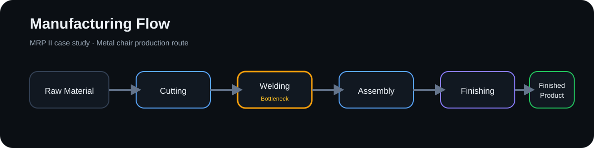

# MRP II & FlexSim Manufacturing Case Study

An academic **group case study** focused on capacity planning, bottleneck analysis, MRP II, and manufacturing simulation.

> **Attribution:** This case originated as Group 2 academic work. This portfolio page is a concise summary and does **not** claim sole authorship of the original group submission. The company and production scenario are fictitious.

## Case

The case analyzes **MetalMueble Andino S.A.C.**, a fictitious manufacturer producing the SMA-01 metal school chair.

Weekly demand is **420 units**, divided across three production orders:

| Production order | Units |
| --- | ---: |
| OP-001 | 160 |
| OP-002 | 140 |
| OP-003 | 120 |
| **Total** | **420** |

## Production route

```text
Raw Material
   ↓
Cutting
   ↓
Welding
   ↓
Assembly
   ↓
Finishing
   ↓
Finished Product
```



## Capacity analysis

| Work center | Required load | Available capacity | Capacity gap |
| --- | ---: | ---: | ---: |
| Cutting | 35.10 h | 68.40 h | +33.30 h |
| Welding | 77.85 h | 64.77 h | **-13.08 h** |
| Assembly | 51.90 h | 68.40 h | +16.50 h |
| Finishing | 60.60 h | 64.80 h | +4.20 h |

The analysis identifies **Welding** as the bottleneck because required workload exceeds available capacity.

## Management interpretation

The case compares required workload against effective capacity to identify overload before production begins. The bottleneck indicates that the production plan cannot be executed as originally configured without an adjustment.

Alternatives evaluated in the academic work included:

- Overtime
- Additional capacity / another station
- Subcontracting

The selected scenario increases welding capacity through overtime, bringing utilization back below 100%.

## FlexSim simulation concept

The same manufacturing route can be represented dynamically in FlexSim with a source, queues, processors, and a sink. The simulation is useful for observing effects that a deterministic capacity table cannot show directly, including:

- Queue accumulation
- Waiting time
- Throughput
- Resource utilization
- Bottleneck behavior over time

This complements MRP II calculations: the spreadsheet provides deterministic planning, while FlexSim provides a dynamic view of material flow and congestion.

## What this case demonstrates

- MRP II capacity planning
- Work-center load analysis
- Utilization and capacity-gap KPIs
- Bottleneck identification
- Evaluation of capacity alternatives
- Manufacturing-process modeling
- Understanding of Excel vs. discrete-event simulation

## Portfolio note

The full original group report and any class-restricted files are intentionally not published here. This page exists only as a professional summary of the concepts, analysis, and simulation approach.
