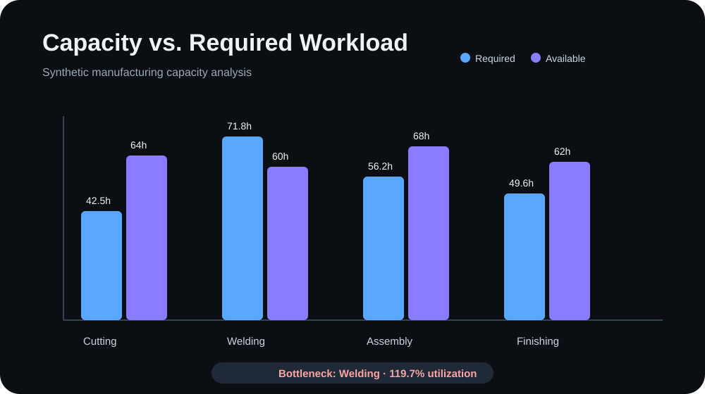

# Operations KPI Dashboard

A compact manufacturing-capacity analysis project focused on workload, available capacity, utilization, bottlenecks, and management-ready KPIs.

> Portfolio lab project created with AI-assisted development. The dataset is synthetic and does not contain company or university-confidential information.

## What it demonstrates

- Capacity planning
- Utilization analysis
- Capacity-gap calculation
- Bottleneck detection
- Python data processing
- Data visualization with Matplotlib
- Business interpretation of operational metrics

## Example result



The sample dataset contains four work centers. The analysis identifies **Welding** as the bottleneck because its required workload exceeds available capacity.

## Metrics

For each work center, the script calculates:

```text
Capacity gap = Available hours - Required hours
Utilization % = Required hours / Available hours × 100
```

A negative capacity gap indicates overload.

## Run locally

```bash
pip install -r requirements.txt
python analyze.py
```

The script prints a KPI summary and generates `capacity_vs_load.svg`.

## Files

```text
operations-kpi-dashboard/
├── analyze.py
├── operations_data.csv
├── capacity_vs_load.svg
└── requirements.txt
```

## Why this project matters

Operational decisions are stronger when managers can see where capacity is sufficient, where it is constrained, and which work center is limiting throughput. This small project turns raw capacity data into a clear operational diagnosis.
